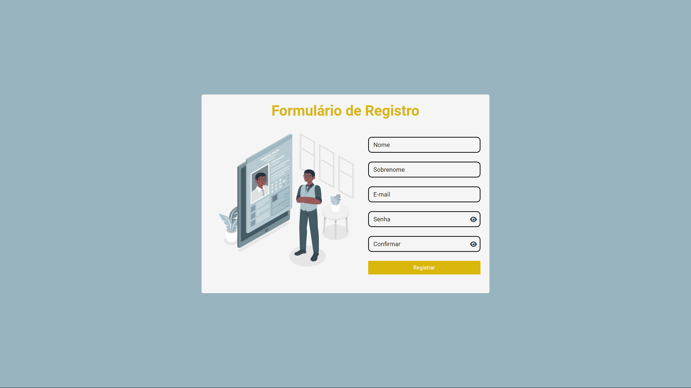

# Formulário de Registro

### [Visitar Projeto](https://formulario-de-registro-tau.vercel.app/)

---

## 📝 Sobre
Projeto de um **Formulário de Registro** onde os inputs são validados, nos inputs de e-mail foi feito uma validação com **RegExp (Expressões Regulares)** onde ele só aceita um texto que contém nome antes e depois do @, e texto depois do ponto, já nas senhas além delas terem que ser iguais, o mínimo de caracteres aceitos são 8. Quando todo os inputs tiverem válidos aparecera uma mensagem informado que a validação do formulário está 100% concluída.

## 🛠️ Tecnologias
Projeto desenvolvido utilizando as seguintes tecnologias:
- HTML
- CSS
- JavaScript

---

Projeto desenvolvido por [Luiz Teles](#)